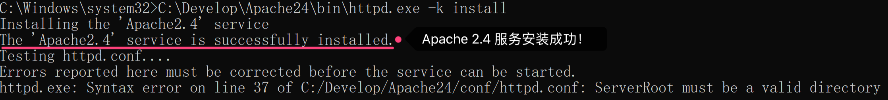
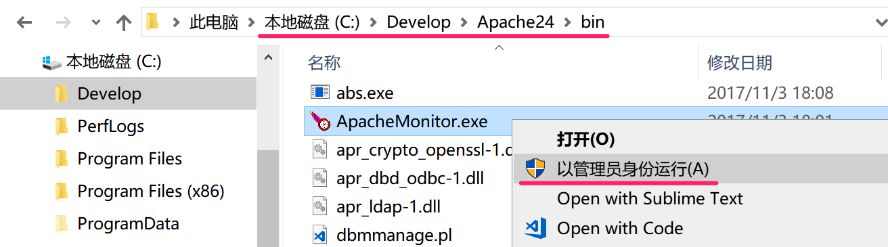
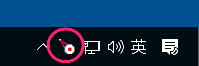
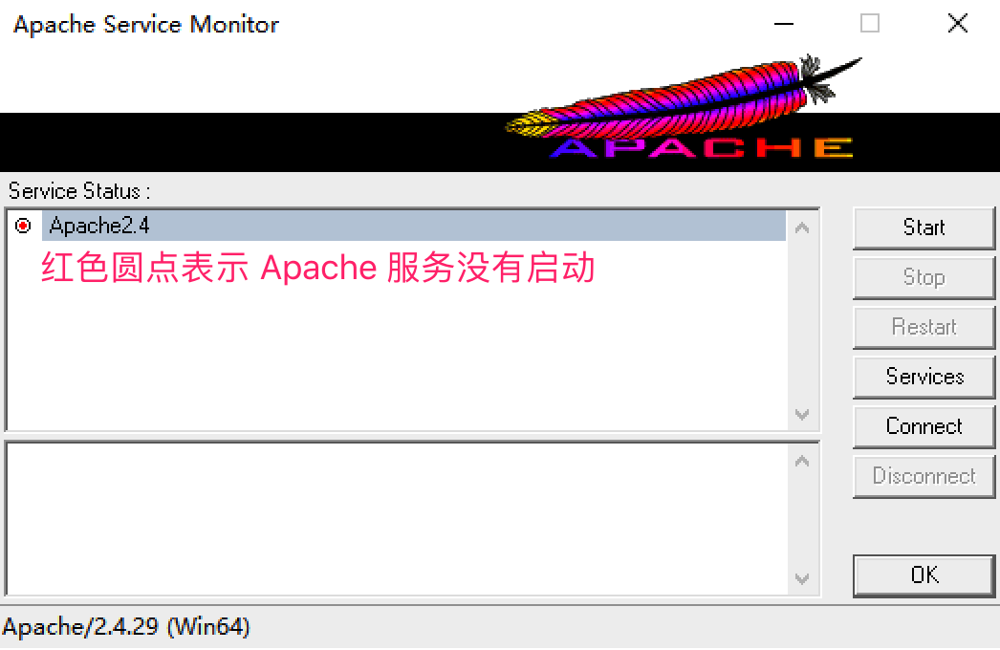
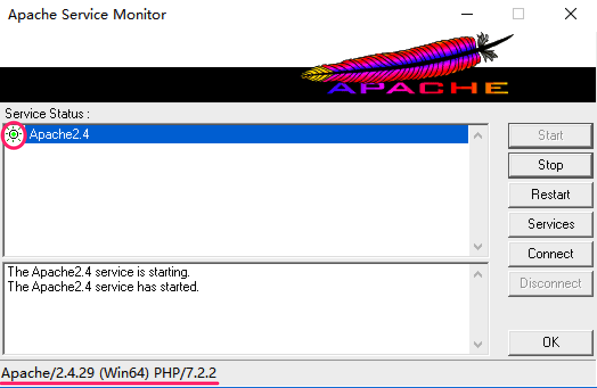
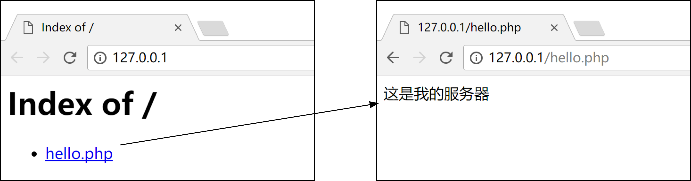
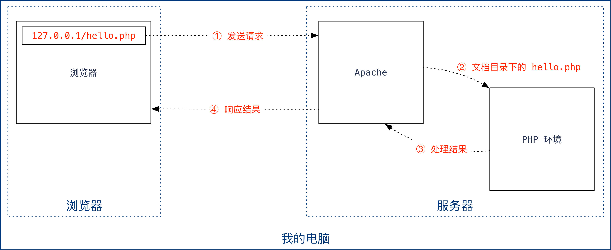

# 配置 Apache 服务器

## 目标

> 在自己的电脑上安装并配置 Web 服务器，体会服务器概念，了解后端开发方式。

* **应用**
  * 能够安装并配置 Apache 服务器

## 1. 安装和配置 Apache 服务器

> Apache 是世界使用排名第一的 Web 服务器软件，使用广泛。

要在自己的电脑上安装一个 Web 服务器，需要以下 3 个步骤：

1. 基本准备工作
2. 安装 Apache 服务
3. 配置 Apache
   * 配置服务器目录
   * 配置文档目录
   * 配置 PHP 支持

### 1.1 基本准备工作

> **准备工作的目的**是为后续安装和配置 Apache **准备好目录和程序文件**。

#### 1) 准备目录

在 **C 盘根目录**建立两个目录：

1. **Develop**：用于存放 **Apache**、**PHP** 等**程序文件**；
2. **www**：用于存放**网站相关内容**，诸如：html、php、css、js、图像等；

> **提示**：为了方便后续的配置操作，建议大家**按照讲义中的名称为目录命名**。

#### 2) 下载安装包

1. 从 https://www.apachelounge.com/download/ 下载最新的 Apache 解压缩版；
2. 从 http://windows.php.net/download/ 下载最新的 PHP 解压缩版。

#### 3) 解压缩并移动位置

1. 解压缩 Apache 的压缩包，将**其中**的 **`Apache24` 目录**移动到 `C:\Develop` 目录下；
2. 解压缩 PHP 的压缩包，将解压目录**重命名为 `php`**，然后移动到 `C:\Develop` 目录下。

### 1.2 安装 Apache 服务

> **安装 Apache 服务的目的**是做到**每次开机 Apache 能够自动运行，方便使用**。

* **以管理员身份**打开**命令行**，然后输入以下命令：

  ```ini
  C:\Develop\Apache24\bin\httpd.exe -k install
  ```

  

  > 提示：这个命令的使用频率不高，不需要记忆，**直接从讲义复制即可**。

* 关闭命令行窗口；

* 使用**文件资源管理器**，找到到 `C:\Develop\Apache24\bin` 目录下的 `ApacheMonitor.exe`

* 点击右键，选择**以管理员身份运行**，如下图所示：

  

* 可以在**任务栏的通知区域**看到 **Apache 服务监视器**图标，如下图所示：

  

* 双击此图标，可以看到如下 **Apache 服务监视器**窗口：

  

> 提示：由于还没有**配置 Apache**，所以现在看到的结果是 **Apache 服务还没有启动。**

### 1.3 配置 Apache

#### 1) 配置服务器目录

> **服务器目录**是 `Apache` 程序文件所在的目录。

1. 使用 `Sublime` 或者 `VSCode` 打开 `C:\Develop\Apache24\conf` 文件夹下的 `httpd.conf` 文件；

   > 提示：不要使用 Windows **自带的记事本**编辑 `httpd.conf` 文件。

2. **搜索并修改顶格的** `ServerRoot` 替换为以下内容：

   ```ini
   ServerRoot "C:/Develop/Apache24"
   ```

   **注意**：

   * 目录的斜线是 `/`（**键盘右侧 SHIFT 左边**）而不是 `\`；
   * 目录的末尾不要使用 `/`。

   **提示**：

   * 配置文件中 `#` 表示注释，所以要找**顶格**的 `ServerRoot`，文件的 **37** 行（不同版本可能会有所不同）。
   * 


#### 2) 配置文档目录

> **文档目录**是**网站的根目录**，也就是使用浏览器能够浏览到这个目录中的内容。

* 在 `httpd.conf` 中**搜索并修改顶格的** `DocumentRoot` 如下：

  ```ini
  DocumentRoot "C:/www"
  <Directory "C:/www">
  ```

  **提示**：文件的 **246、247** 两行（不同版本可能会有所不同）。

#### 3) 配置 PHP 支持

> 添加 PHP 模块，让 Apache 服务器能够处理 `.php` 扩展名的文件。

* 在 `httpd.conf` **文件的末尾**增加以下内容：

    ```ini
    # php 支持
    LoadModule php7_module C:/Develop/php/php7apache2_4.dll

    <IfModule mime_module>
        AddType application/x-httpd-php .php
    </IfModule>
    ```


到目前为止，服务器**配置工作已全部完成**，直接直接关闭 `httpd.conf` 即可。

## 2. 启动和测试 Apache 服务器

### 2.1 启动 Apache 服务器

* 点击 **Apache 服务监视器**中的 **start** 按钮启动 Apache 服务，如果配置正确，可以看到如下窗口：

  

**常见问题**：

1. 没有按照讲义中**要求的目录名称**命名

   * **解决办法**，检查**基本准备工作**中的目录命名是否正确；

     > **提示**：今后大家对服务器熟悉之后，可以尝试自行定制，初次安装建议按照讲义中的步骤操作。

2. `httpd.conf` 中的配置内容输入错误

   * **解决办法**，从讲义中复制配置内容，然后粘贴到对应位置；

     > **提示**：`httpd.conf` 的内容只需要配置一次，不需要记忆，配置内容直接复制、粘贴就行。

3. 在 **Apache 服务器监视器**下方只能看到 `Apache` 看不到 `PHP`

   * **解决办法**：如果确实添加了 PHP 的配置。可以尝试关闭窗口，重新打开，可以刷新监视器窗口的显示。

### 2.2 测试 Apache 服务器

1. 在 `C:\www` 目录下新建一个空白的文本文件，并且重命名为 `hello.php`；

2. 使用 `Sublime` 或者 `VSCode` 打开 `hello.php` 并输入以下内容：

   ```php
   <?php echo '这是我的服务器'; ?>
   ```

3. 打开浏览器，在地址栏输入 `127.0.0.1`，然后按照下图操作：

   

> 提示：在 `C:\www` 目录下放一些图片或 html 再重复上述操作看看效果。

### 2.3 安装属于自己的 Web 服务器

请各位同学按照讲义安装属于自己的 Web 服务器。

> **提示**：以上配置工作只需要操作一次，后续课程是**直接使用配置好的环境，而不再需要重复配置**。

## 3. Apache + PHP 工作示意图（了解）


