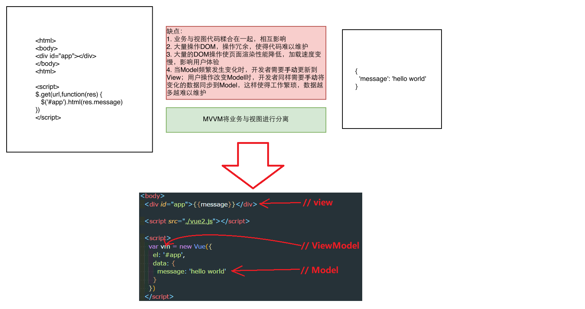
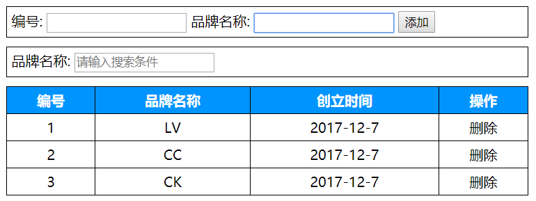

Vue基础-day01
===
<!-- TOC -->

- [课前准备](#课前准备)
  - [浏览器插件](#浏览器插件)
  - [VS Code插件](#vs-code插件)
  - [玩转Vs code](#玩转vs-code)
- [课程介绍](#课程介绍)
  - [为什么学习Vue](#为什么学习vue)
  - [什么是MVVM](#什么是mvvm)
  - [Vue初体验](#vue初体验)
- [Vue常用系统指令](#vue常用系统指令)
  - [插值表达式](#插值表达式)
  - [v-text](#v-text)
  - [v-html](#v-html)
  - [v-bind](#v-bind)
  - [v-for](#v-for)
  - [v-model](#v-model)
  - [v-on](#v-on)
  - [v-on按键修饰符](#v-on按键修饰符)
  - [v-if](#v-if)
  - [v-show](#v-show)
  - [v-cloak](#v-cloak)
- [案例-利用系统指令实现品牌案例管理](#案例-利用系统指令实现品牌案例管理)
  - [目的](#目的)
  - [资源准备](#资源准备)
  - [功能-数据展示实现](#功能-数据展示实现)
  - [功能-数据删除](#功能-数据删除)
  - [功能-数据添加](#功能-数据添加)
  - [功能-按回车键添加数据](#功能-按回车键添加数据)
  - [功能-输入框自动聚焦](#功能-输入框自动聚焦)
  - [ref](#ref)
  - [功能-时间格式化](#功能-时间格式化)
  - [过滤器](#过滤器)

<!-- /TOC -->

## 课前准备

### 浏览器插件

  * Vue.js devtools

### VS Code插件

自动补全标签
  * Auto Close Tag
  * Auto Complete Tag
  * Auto Rename Tag

开启一个服务器浏览HTML网页，第一次使用需要Ctrl + Shift + p输入 live server选择open
  * Live Server

路径自动补全
  * Path Intellisense

vue语法高亮和自动补全代码
  * Vetur
  * VueHelper

### 玩转Vs code

  *  [Vs Code奇淫技巧](https://github.com/Microsoft/vscode-tips-and-tricks)

  * Vs Code设置

  文件--->首选项--->设置，然后添加如下代码：

  ```json
    "emmet.syntaxProfiles": {
        "vue-html": "html",
        "vue": "html"
    },
    "emmet.includeLanguages": {
        "vue-html": "html",
        "vue": "html"
    }
  ```
## 课程介绍

### 为什么学习Vue

  
	
### 什么是MVVM

    - M => Model(数据模型)
    - V => View(视图模型,负责将数据模型转化成UI展现出来，就是那些DOM结构)
    - VM => ViewModel(一个同步View和Model的对象)



### Vue初体验

```html
<!DOCTYPE html>
<html lang="en">
<head>
  <meta charset="UTF-8">
  <meta name="viewport" content="width=device-width, initial-scale=1.0">
  <meta http-equiv="X-UA-Compatible" content="ie=edge">
  <title>Document</title>
  <!-- 1. 引入vue文件 -->
  <script src="./vue2.js"></script>
</head>
<body>
  <!-- 如果超过vue实例的管辖范围，这个{{}}作用就会失效 -->
  <div>{{msg}}</div>
  <div id="app">
    <!-- 5. 展示数据：通过插值表达式{{}} ，作用是专门用来渲染文本-->
    <h1>{{msg}}</h1>
  </div>
  <script>
    // 2. 创建vue实例，作用：他会监管我们的html代码
    var vm = new Vue({
      // 3. 通过一个el属性来指定vue实例的监管范围,后面跟一个id
      el: '#app',
      // 4. 用data属性将要展示的变量存起来,data后面跟一个对象
      data: {
        msg: 'hello world'
      }
    })
  </script>
</body>
</html>
```
## Vue常用系统指令

### 插值表达式

  ```html
    数据绑定最常见的形式，其中最常见的是使用插值表达式，写法是{{}} 中写表达式
    例如：<span>Message: {{ msg }}</span>
    Mustache 标签将会被替代为对应数据对象上 msg 属性（msg定义在data对象中）的值。
    无论何时，绑定的数据对象上 msg 属性发生了改变，插值处的内容都会更新。

    {{}}对JavaScript 表达式支持，例如：
    {{ number + 1 }}
    {{ ok ? 'YES' : 'NO' }}
    {{ message.split('').reverse().join('') }}

    但是有个限制就是，每个绑定都只能包含单个表达式，如下表达式无效：
    <!-- 这是语句，不是表达式 -->
    {{ var a = 1 }}

    <!-- 这也是语句，不是表达式 -->
    {{ number++ }} 会报警告：vue2.js:482 [Vue warn]: You may have an infinite update loop in a component render function.

    <!-- 流控制也不会生效，请使用三元表达式 -->
    {{ if (ok) { return message } }}
  ```

### v-text

  ```html
  <!-- v-text可以将一段文本渲染到指定的元素中,例如： -->
  <div v-text="msg"></div>
  new Vue({
      data:{
          msg:'hello world'
      }
  });

  <!-- 输出结果：-->
  <div>hello world</div>
  ```

### v-html

  ```html
  差值表达式和v-text会将数据解释为纯文本，而非 HTML 。
  为了输出真正的 HTML ，你需要使用 v-html 指令：
  例如：
  <div v-html="rawHtml"></div>
      new Vue({
          data:{
              rawHtml:'<h1>hello world</h1>'
          }
  })

  被插入的内容都会被当做 HTML,但是对于没有HTML标签的数据绑定时作用同v-text和{{}}
  ```

### v-bind

  ```html
  1、作用：可以给html元素或者组件动态地绑定一个或多个特性，例如动态绑定style和class

  2、举例：
      1、img的src从imageSrc变量中取得
          

          2、从classA, classB两个变量的值作为class的值，
          结果是：<div class="A B">classA, classB</div>        
          <div v-bind:class="[classA, classB]">classA, classB</div>

          3、isRed变量如果为true，则class的值为red，否则没有
          <div v-bind:class="{ red: isRed }">isred</div>

          4、div的class属性值一定有classA变量的值，而是否有classB和classC变量的值取决于isB和isC是否为true，二者一一对应
          <div v-bind:class="[classA, { classB: isB, classC: isC }]">数组对象</div>

          5、变量加常量
          <div v-bind:style="{ fontSize: size + 'px' }">size22</div>

          6、变量加常量的另一种写法
          

          7、对象数组
          <div v-bind:style="[styleObjectA, styleObjectB]">styleObjectA, styleObjectB</div>

  3、缩写形式
      
      <div :class="[classA, classB]">classA, classB</div>
      <div v-bind:class="{ red: isRed }">isred</div>
      <div v-bind:class="[classA, { classB: isB, classC: isC }]">数组对象</div>
      <div v-bind:style="{ fontSize: size + 'px' }">size22</div>
      
      <div v-bind:style="[styleObjectA, styleObjectB]">styleObjectA, styleObjectB</div>


    vue对象初始化
    <script>
      // 实例化vue对象（MVVM中的View Model）
      new Vue({
          // vm控制的区块为id为app的div，此div中的所有vue指令均可以被vm解析
          el:'#app',
          data:{
          // 数据 （MVVM中的Model）   
          imageSrc:'http://157.122.54.189:8998/vue/vuebase/chapter1/imgs/d1-11.png',
          isRed:true,
          classA:'A',
          classB:'B',
          isB:true,
          isC:true,
          size:22,
          styleObjectA:{color:'red'},
          styleObjectB:{fontSize:'30px'}
          },
          methods:{

          }
      })
  </script>
  ```

### v-for

  ```html
  <!-- 
    v-for用法：
      item in Array
      (item, index) in Array
      value in Object
      (value, key, index) in Object

    :key属性具有唯一性，不能重复，它能够唯一标识数组的每一项
    将来数据中的某一项的值发生了改变，则v-for只会更新当前项对应的这个dom元素的值，而不是更新整个数据，从而提高效率，参考https://www.zhihu.com/question/61064119/answer/183717717

    注意：以下变动不会触发视图更新
      1. 通过索引给数组设置新值
      2. 通过length改变数组
    解决：
      1. Vue.set(arr, index, newValue)
      2. arr.splice(index, 1, newValue)
    -->
    <ul>
      <li v-for="item in user">{{item.name}}</li>
      <li v-for="(item, index) in user" :key="index">{{index}}.{{item.name}}</li>
      <li>---------------华丽的分割线---------------</li>
      <li v-for="value in boss">{{value}}</li>
      <li v-for="(value, key, index) in boss"> {{index}}.{{key}}:{{value}}</li>
    </ul>
    <script>
    var vm = new Vue({
      el: '#app',
      data: {
        user: [
          {name: 'jack'},
          {name: 'neil'},
          {name: 'rose'}
        ],
        boss: {
          name: '马云',
          age: 50,
          money: 1000000002030
        }
      }
    })
    </script>
  ```

### v-model

  ```html
  1、在表单控件或者组件上创建双向绑定
  2、v-model仅能在如下元素中使用：
    input
    select
    textarea
    components（Vue中的组件）

  3、举例：
    <input type="text" v-model="uname" />

  new Vue({
      data:{
          uname:'' //这个属性值和input元素的值相互一一对应，二者任何一个的改变都会联动的改变对方
        }
  })
  ```

### v-on

  ```html
  1、作用：绑定事件监听，表达式可以是一个方法的名字或一个内联语句，
  如果没有修饰符也可以省略，用在普通的html元素上时，只能监听 原生
  DOM 事件。用在自定义元素组件上时，也可以监听子组件触发的自定义事件。

  2、常用事件：
      v-on:click
      v-on:keydown
      v-on:keyup
      v-on:mousedown
      v-on:mouseover
      v-on:submit
      ....

  3、示例：
    <!-- 方法处理器 -->
    <button v-on:click="doThis"></button>
    <!-- 内联语句 -->
    <button v-on:click="doThat('hello', $event)"></button>

    <!-- 阻止默认行为，没有表达式 -->
    <form v-on:submit.prevent></form>

   5、v-on的缩写形式：可以使用@替代 v-on:
    <button @click="doThis"></button>


  6、按键修饰符
    触发像keydown这样的按键事件时，可以使用按键修饰符指定按下特殊的键后才触发事件

    写法：
      <input type="text" @keydown.enter="kd1">  当按下回车键时才触发kd1事件

      由于回车键对应的keyCode是13，也可以使用如下替代
      <input type="text" @keydown.13="kd1">  当按下回车键时才触发kd1事件

      但是如果需要按下字母a（对应的keyCode=65）才触发kd1事件，有两种写法：
      1、由于默认不支持a这个按键修饰符，需要Vue.config.keyCodes.a = 65 添加一个对应,所以这种写法为：

      Vue.config.keyCodes.a = 65
      <input type="text" @keydown.a="kd1">  这样即可触发

      2、也可以之间加上a对应的数字65作为按键修饰符
      <input type="text" @keydown.65="kd1">  这样即可触发

      键盘上对应的每个按键可以通过 http://keycode.info/ 获取到当前按下键所对应的数字
  ```

### v-on按键修饰符

  * 作用说明

  ```html
    文档地址：https://cn.vuejs.org/v2/guide/events.html#键值修饰符

    在监听键盘事件时，我们经常需要监测常见的键值。 Vue 允许为 v-on 在监听键盘事件时添加按键修饰符：
    .enter
    .tab
    .delete (捕获 “删除” 和 “退格” 键)
    .esc
    .space
    .up
    .down
    .left
    .right
  ```

  * 可以自定义按键别名

  ```html
    // 在Vue2.0版本中扩展一个f1的按键修饰符写法：
    Vue.config.keyCodes.f1 = 112

    // 使用
    <button @keyup.f1="someFunc"></button>
  ```

### v-if

  ```html
  1、作用：根据表达式的值的真假条件来决定是否渲染元素，如果条件为false不渲染（达到隐藏元素的目的），为true则渲染。在切换时元素及它的数据绑定被销毁并重建

  2、示例：
    <!-- Handlebars 模板 -->
    {{#if isShow}}
      <h1>Yes</h1>
    {{/if}}

    通常我们使用写法居多：
    <h1 v-if="isShow">Yes</h1>

    也可以用 v-else 添加一个 “else” 块：
    <h1 v-if="isShow">Yes</h1>
    <h1 v-else>No</h1>

    注意：v-else 元素必须紧跟在 v-if 元素否则它不能被识别。

    new Vue({
        data:{
          isShow:true
        }
    });
  ```

### v-show

  ```html
  1、根据表达式的真假值，切换元素的 display CSS 属性，如果为false，则在元素上添加 display:none来隐藏元素，否则移除display:none实现显示元素

  2、示例：
      <h1 v-show="isShow">Yes</h1>

      new Vue({
          data:{
            isShow:true
              }
      });

  3、v-if和v-show的总结：
      v-if和v-show 都能够实现对一个元素的隐藏和显示操作,但是v-if是将这个元素添加或者移除到dom中，而v-show
      是在这个元素上添加 style="display:none"和移除它来控制元素的显示和隐藏的
  ```

### v-cloak

  ```html
  v-cloak指令保持在元素上直到关联实例结束编译后自动移除，v-cloak和 CSS 规则如 [v-cloak] { display: none } 一起用时，这个指令可以隐藏未编译的 Mustache 标签直到实例准备完毕。
  通常用来防止{{}}表达式闪烁问题
  例如：
  <style>
  [v-cloak] { display: none }
  </style>

  <!-- 在span上加上 v-cloak和css样式控制以后，浏览器在加载的时候会先把span隐藏起来，知道 Vue实例化完毕以后，才会将v-cloak从span上移除，那么css就会失去作用而将span中的内容呈现给用户 -->
  <span v-cloak>{{msg}}</span>    

  new Vue({
      data:{
          msg:'hello ivan'
        }
  })
  ```

## 案例-利用系统指令实现品牌案例管理

### 目的

  通过案例熟悉Vue系统指令的用法和结构的写法练习，做到知识点的巩固和学会
  应用，并且在案例的扩展需求中，学习Vue新知识点，做到先有需求，再有知识点
  学习，最后到知识点的应用，让学员学习知识点的同时学会知识点的应用

### 资源准备

  * 效果图<br/>
    

  * 案例html结构
  ```html
    <body>
    <div id="app">
    <div class="add">
        编号:<input type="text">
        品牌名称:<input type="text">
        <input type="button" value="添加">
    </div>

    <div class="add">
        品牌名称:<input type="text" placeholder="请输入搜索条件">
    </div>

    <div>
        <table class="tb">
            <tr>
                <th>编号</th>
                <th>品牌名称</th>
                <th>创立时间</th>
                <th>操作</th>
            </tr>
            <tr >
                <td colspan="4">没有品牌数据</td>
            </tr>
        <!-- 动态生成内容tr -->
        </table>
    </div>
    </div>
    </body>
  ```

  * 案例css样式

  ```html
    <style>

      #app{
          width:600px;
              margin:10px auto;
      }
        .tb{
            border-collapse:collapse;
            width: 100%;
        }
        .tb th{
            background-color: #0094ff;
            color:white;
        }

        .tb td,.tb th{
            padding:5px;
            border:1px solid black;
            text-align: center;
        }

        .add{
            padding: 5px;
            border:1px solid black;
            margin-bottom: 10px;
        }
    </style>
  ```

### 功能-数据展示实现

  1. 在 data 中添加 一个名称为 list的变量，类型为数组,存放品牌数据的对象,格式为:{id:1,name:'宝马',ctime:Date()}

  ```js
  var vm = new Vue({
    el: '#app',
    data: {
      list: [
        {id: 1, title: 'LV', ctime: new Date()},
        {id: 2, title: 'CC', ctime: new Date()},
        {id: 3, title: 'CK', ctime: new Date()},
      ]
    }
  })
  ```

  2. 在table中的“动态生成内容tr”位置使用v-for指令遍历list数组数据生成表格内容行，注意要写`:key`

  ```html
        <tr v-for="(item, index) in list" :key="index">
          <td>{{item.id}}</td>
          <td>{{item.title}}</td>
          <td>{{item.ctime}}</td>
          <td>
            <a href="javascript:void(0)">删除</a>
          </td>
        </tr>
  ```

  3. 处理 “没有品牌数据” 提示问题,代码如下

  ```html
利用：v-if进行判断，当list为空时，才显示没有品牌数据

 <tr v-if="list.length==0">
    <td colspan="4">没有品牌数据</td>
</tr>
  ```

### 功能-数据删除

  1. 给按钮绑定删除方法，并传入一个id

  ```html
  <a href="javascript:void(0)" @click="deleteData(item.id)">删除</a>
  ```

  2. Vue实例中定义删除的方法
  ```js
    methods: {
      deleteData(id) {
        // 返回满足函数条件的数组的项的index
        var index = this.list.findIndex(item => {
          return item.id === id
        })
        // 删除该索引对应的值
        this.list.splice(index, 1)
      }
    }
  ```

### 功能-数据添加

  * 效果图</br>
    

  1. 实现步骤1：在Vue对象实例的data中添加一个product对象{id:0,name:'',ctime:Date()}

  ```js
 new Vue({
    el: '#app',
    data: {
        product:{id:0,name:'',ctime:Date()},        
        list:[
            {id:1,name:'宝马',ctime:Date()},
            {id:2,name:'奔驰',ctime:Date()}
        ]
    },
    methods: {      
    }
  })
  ```

  2. 实现步骤2：在编号和品牌名称文本框中利用v-model对product对象中的id和name属性进行一一绑定 同时在添加按钮上利用 v-on:click注册事件addData

  ```html
  编号:<input type="text" v-model="product.id">
  品牌名称: <input type="text" v-model="product.name">
  <input type="button" value="添加" @click="addData">
  ```

  3. 实现步骤3：在Vue对象实例的methods中添加一个 addData的方法实现添加逻辑即可完成

  ```js
  new Vue({
      // vm控制的区块为id为app的div，此div中的所有vue指令均可以被vm解析
      el: '#app',
      data: {
          product:{id:0,name:'',ctime:Date()},
          list:[
              {id:1,name:'宝马',ctime:Date()},
              {id:2,name:'奔驰',ctime:Date()}
          ]
      },
      methods: {
          addData(){
              // 修改品牌添加时间为当前时间
              this.product.ctime = Date();

              // 添加数据到品牌列表中
              this.list.push(this.product);

              // 清空product
              this.product = {id:0,name:'',ctime:Date()};
          }
      }
  })
  ```

### 功能-按回车键添加数据

  **关键点：利用v-on的.enter按键修饰符实现，回车键的keycode=13**</br>
  

  ```html
  品牌名称: <input type="text" v-model="product.name" @keydown.13="addData">

  <!-- 或者 -->
  品牌名称: <input type="text" v-model="product.name" @keydown.enter="addData">
  ```
### 功能-输入框自动聚焦

  在vue中实现这个需求有三种方式：
  * 可以使用document.getElementById()获取到文本框元素对象后调用其focus()方法和设置style属性
  * 可以在文本框上元素上增加一个 ref="自定义名称"，再使用this.$refs.自定义名称.focus()和
    this.$refs.自定义名称.style="color:red" 设置style属性
  * 使用自定义指令实现封装

  > 注意：前两种方式的代码需要写到生命周期事件：mounted(){}中

  1. 原生js操作DOM实现

  ```html
    // html代码
    编号:<input type="text" v-model="product.id" id="id">

    // vue对象mounted(){}中代码
    mounted(){
        document.getElementById('id').focus();
        document.getElementById('id').style="color:red";
    }
  ```

  2. ref方式实现

  ```html
    // html代码：
    编号:<input type="text" v-model="product.id" ref="id">

    // vue对象mounted(){}中代码
    mounted(){
        this.$refs.id.focus();
        this.$refs.id.style="color:red";
      }
  ```
  3. 使用自定义指令

  * 使用说明

    - 利用Vue.directive('指令id',{inserted:function(el,binding){}})
    - 参数说明
      + 指令id可由程序员自行定义，注意和系统指令名称有所区别，例如：
      focus,在某个元素上具体使用的时候请在 指令id前面再加上v-,例如
      `<input v-focus>`

      + 第二个参数是一个对象，其中inserted是一个函数，表示 “被绑定元素插入父节点时调用”
          * inserted的参数：
            - el参数：表示使用此自定义指令的dom对象
            - binding参数：一个对象，包含以下属性：
              + name：指令名，不包括 v- 前缀。
              + value：指令的绑定值，例如：v-focus="colorvalue", value 的值是colorvalue这个变量的值，colorvalue定义在data(){}中
              + expression：绑定值的字符串形式。例如 v-focus="colorvalue" ，expression 的值是 "colorvalue"

  * 开始使用Vue.directive()封装自定义指令v-focus实现光标自动定位

  ```html
  1、定义指令color
    Vue.directive('color',{
        inserted:function(el,binding){
          //将颜色设置给使用v-color指令的元素上
          el.style.color=binding.value;
        }
    });


  2、 在dom元素上使用指令，注意加上前缀 v-
  编号:<input type="text" v-model="product.id" v-color="colorvalue">

  3、在Vue对象实例中的data(){}中定义colorvalue
    new Vue({
      data: {
          colorvalue:'red'
      }
    });
  ```

### ref

ref的作用类似于document.getElementByID,在vue中想要获取一个dom对象或者组件对象，则只需要 在此元素上添加一个 ref="自定义名称" ，再使用 this.$refs.自定义名称即可获取

  ```html
  <html>
  <head>
    <script src="vue2.js"></script>
  </head>
    <body>
      <div id="app">
      <span ref="sp"></span>
      </div>
    </body>
    <script>
      new Vue({
        el:'#app',
        methods:{
          getobj:function(){
            //获取到span元素的dom对象，类似于使用document.getElementByID('sp')
            // spanobj就是span的dom对象，可以调用 style,innerHTML,innerText等进行操作
              var spanobj =  this.$refs.sp;              
          }
        }
        })
    </script>
  </html>
  ```

### 功能-时间格式化

  ```html
  // 定义全局过滤器datefmt
  Vue.filter('datefmt',function(input){
      var date = new Date(input);
      var year = date.getFullYear();
      var m = date.getMonth() + 1;
      var d = date.getDate();            
      var fmtStr = year+'-'+m +'-'+d;
      return fmtStr; //返回输出结果
  });

  // 调用, 注意datefmt的第一个参数默认就是管道符左边的值
  <td>{{item.ctime | datefmt }}</td>
  ```

### 过滤器

  1. 私有过滤器

  * 定义方式

        可以在 new Vue({filters：{}})中的filters中注册一个私有过滤器

        定义格式：
        new Vue({
          el:'#app',
          filters:{        
              '过滤器名称':function(管道符号|左边对象的值,参数1,参数2,....) {
                return 对管道符号|左边参数的值做处理以后的值
              })    
          }
          });

        Vue2.0 调用过滤器传参写法：
        <span>{{ msg | 过滤器id('参数1','参数2' ....) }}</span>

  * (应用示例)自定义私有过滤器实现日期格式化

      ```html
        1、 定义私有的日期格式化过滤器：
        new Vue({
            el:'#app',
            data:{
                time:new Date()
            },
            filters:{
                //定义在 VM中的filters对象中的所有过滤器都是私有过滤器
                datefmt:function(input,splicchar){
                    var date = new Date(input);
                    var year = date.getFullYear();
                    var m = date.getMonth() + 1;
                    var d = date.getDate();            
                    var fmtStr = year+splicchar+m +splicchar+d;
                    return fmtStr; //返回输出结果
                }
            }
        });
        2、使用
        <div id="app">
          {{ time | datefmt('-') }} //Vue2.0传参写法
        </div>
      ```

  2. 全局过滤器

  * 定义方式

        可以用全局方法 Vue.filter() 注册一个全局自定义过滤器，它接收两个参数：过滤器 ID 和过滤器函数。过滤器函数以值为参数，返回转换后的值

        定义格式：
        Vue.filter('过滤器名称', function (管道符号|左边参数的值,其他参数1,其他参数2,....) {
          return 对管道符号|左边参数的值做处理以后的值
        })

        Vue2.0 使用：参数调用时用()，多个参数中间使用逗号分开
        <span>{{ msg | 过滤器名称('参数1','参数2' ....) }}</span>

  * (应用示例)自定义全局过滤器实现日期格式化

    ```html
      1、 定义全局的日期格式化过滤器：
      Vue.filter('datefmt',function(input,splicchar){
          var date = new Date(input);
          var year = date.getFullYear();
          var m = date.getMonth() + 1;
          var d = date.getDate();            
          var fmtStr = year+splicchar+m +splicchar+d;
          return fmtStr; //返回输出结果
      });    

      2、使用
          <div id="app">
            {{ time | datefmt('-') }} //Vue2.0传参写法
          </div>
          
        <script>  
            new Vue({
                el:'#app1',
                data:{
                    time:new Date()
                }
            });
        </script>
    ```
