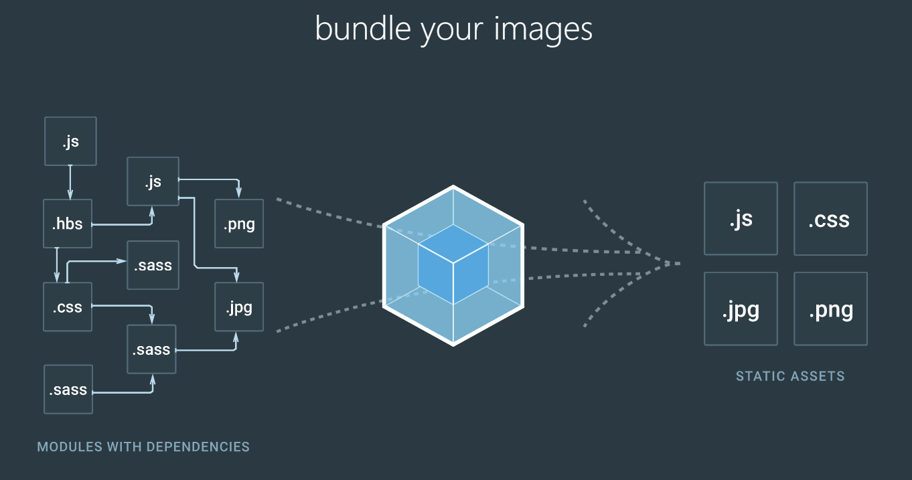

Vue基础-day04
===

<!-- TOC -->

- [webpack](#webpack)
  - [什么是webpack](#什么是webpack)
  - [为什么需要webpack](#为什么需要webpack)
  - [webpack安装](#webpack安装)
  - [使用webpack](#使用webpack)
    - [01-webpack-cli](#01-webpack-cli)
    - [02-webpack-config](#02-webpack-config)
    - [03-webpack-dev-server](#03-webpack-dev-server)
    - [04-webpack-css](#04-webpack-css)
    - [05-webpack-less&webpack-sass](#05-webpack-lesswebpack-sass)
    - [06-webpack-图片&字体](#06-webpack-图片字体)
    - [07-webpack-html](#07-webpack-html)
    - [08-webpack-babel](#08-webpack-babel)

<!-- /TOC -->

## webpack

### 什么是webpack

  webpack 是一个现代 JavaScript 应用程序的模块打包器(module bundler)，分析你的项目结构，找到JavaScript模块以及其它的一些浏览器不能直接运行的拓展语言（Sass，TypeScript等），并将其转换和打包为合适的格式供浏览器使用。

  

### 为什么需要webpack

现在的前端，越来越复杂，特别是SPA（single page web application）流行之后，一个应用程序往往会依赖很多其他的模块，或者编译scss、less、stylus等，如果仅仅是靠人来管理是不可能的，这个时候我们必须依赖于webpack来解决。

现在最流行的三个SPA的框架，都于webpack紧密相连。
* React.js + webpack
* Vue.js + webpack
* Angular.js + webpack

学习webpack有4个重点内容：
* 入口(entry)
* 输出(output)
* 加载器(loader)
* 插件(plugins)

### webpack安装

注意：请先安装node环境

建议大家这样操作(随时切换镜像源)：
​    1. npm install nrm -g // 安装nrm
​    2. nrm ls // 查看镜像源
​    3. nrm use taobao // 选择淘宝镜像，也可以选择cnpm

4. npm install webpack@3.11.0 -g

### 使用webpack

#### 01-webpack-cli ：就是告诉你它有什么用：将浏览器不支持的源文件打包转换为浏览器支持的文件

使用命令：`webpack 输入文件路径 打包后文件路径`将一个文件打包成另外一个文件

#### 02-webpack-config：能够简化命令的输入。不用再指定源路径和目标路径

1. 配置webpack.config.js:文件不要随意
2. 运行`webpack`

  ```js
  var path = require('path')

  module.exports = {
    // 入口文件配置
    entry: "./src/app.js",

    // 出口文件配置项
    output: {
      // 输出的路径，webpack2起就规定必须是绝对路径
      path: path.join(__dirname, 'dist'),
      // 输出文件名字
      filename: "bundle.js"
    }
  }
  ```

#### 03-webpack-dev-server：能够自动打开浏览器，对于代码的修改能够自动刷新， 同时输入命令更爽

默认为--inline模式

1. 运行：`npm init -y`
2. 运行：`npm i webpack-dev-server@2.9.7 webpack@3.11.0 -D`  `npm i webpack-dev-server@2.9.7 -g`
```js
  var path = require('path')

  module.exports = {
    // 入口文件配置
    entry: "./src/app.js",

    // 输出配置
    output: {
      // 输出的路径
      path: path.join(__dirname, 'dist'),
      // 静态资源在服务器上运行时的访问路径，可以直接http://localhost:8080/dist/bundle.js访问到服务器中的bundle.js文件
      publicPath: '/dist',
      // 输出文件名字
      filename: "bundle.js"
    }
  }
```
3. index.html中修改 `<script src="/dist/bundle.js"></script>`

4. 运行：`webpack-dev-server`
5. 运行：`webpack-dev-server --inline --hot --open --port 8090` --hot热重载
6. 配置script：`"dev": "webpack-dev-server --inline --hot --open --port 8090"` 在package.json文件中配置
7. `npm run dev`

#### 04-webpack-css:可以来解析css

1. 安装`npm install css-loader style-loader --save-dev`
   1. css-loader 用于处理后缀名为.css的文件
   2. style-loader 用于将处理好的样式，加入到页面中的style标签中去

```js
  module: {
    rules: [
      // 配置的是用来解析.css文件的loader(style-loader和css-loader)
      {
        // 1.0 用正则匹配当前访问的文件的后缀名是  .css
        test: /\.css$/,
        use: ['style-loader', 'css-loader'] //webpack底层调用这些包的顺序是从右到左
      }
    ]
  }
```

#### 05-webpack-less&webpack-sass：可以创建和解析less和scss

`npm install less less-loader sass-loader node-sass --save-dev`

```js
{
    test: /\.less$/,
    use: [{
        loader: 'style-loader'
    }, {
        loader: 'css-loader'
    }, {
        loader: 'less-loader'
    }]
},
```

```js
{
    test: /\.scss$/,
    use: [{
        loader: 'style-loader'
    }, {
        loader: 'css-loader'
    }, {
        loader: 'sass-loader'
    }]
}
```


#### 06-webpack-图片&字体：可以使用图标和图片

1. `npm install file-loader url-loader --save-dev`

url-loader封装了file-loader

```js
{
    test: /\.(png|jpg|gif|eot|svg|ttf|woff)/,
    use: [{
        loader: 'url-loader',
        options: {
          // limit表示如果图片大于50000byte，就以路径形式展示，小于的话就用base64格式展示
            limit: 50000
        }
    }]
}
```

#### 07-webpack-html：在html文件中自动引入js文件

1. `npm install html-webpack-plugin --save-dev`

2. 如果添加了title，需要在模板中添加`<%= htmlWebpackPlugin.options.title %>`

```js
// 注意需要注释掉publicPath，不然会冲突  配置都是在webpack.config.js文件中

var HtmlWebpackPlugin = require('html-webpack-plugin')

plugins: [
    new HtmlWebpackPlugin({
        filename: 'index.html',
        template: 'template.html'
    })
]
```

#### 08-webpack-babel

1. `npm install babel-core  babel-loader babel-preset-env --save-dev`

注意：

webpack 1.x | babel-loader <= 6.x  

webpack 2.x | babel-loader >= 7.x (推荐) (^6.2.10 也能用, 但是会出现不推荐使用的警告)

webpack 3.x | babel-loader >= 7.1

```js
    {
      test: /\.js$/,
      // Webpack2建议尽量避免exclude，更倾向于使用include
      // exclude: /(node_modules)/, // node_modules下面的.js文件会被排除
      include: [path.resolve(__dirname, 'src')],
      use: {
        loader: 'babel-loader',
        // options里面的东西可以放到.babelrc文件中去
        options: {
          presets: ['env']
        }
      }
    }

// .babelrc文件内的配置
{
  "presets":["env"]
}
```


